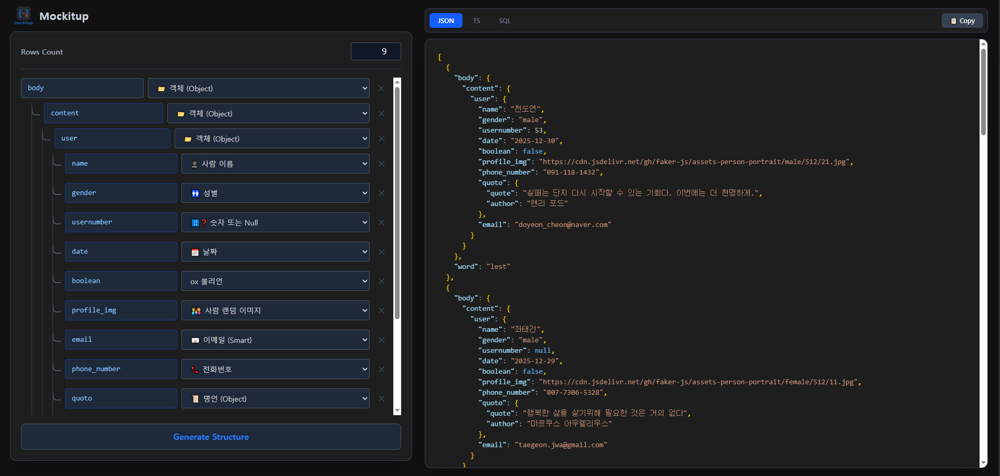

# 📦 mockitup

> **Tree-based Recursive Mock Data Generator** > 복잡한 Mock 데이터를 트리 구조로 쉽게 설계하고 JSON, TypeScript, SQL 포맷으로 생성하세요.

 

## 🔗 Live Demo

👉 **[Try mockitup now](https://JJleem.github.io/Mockitup)**

 

## 📸 Preview

> **Mockitup** allows you to visually build deep, nested data structures and instantly generates code for your frontend, backend, or database.

 

## ✨ Key Features

- **🌲 Recursive Tree Editor**: 직관적인 UI로 깊이 제한 없는 중첩 객체/배열 구조를 설계할 수 있습니다.
- **🇰🇷 Korean Data Support**: `fakerKO`를 활용하여 한국 이름, 주소, 연락처 등 현실적인 한국형 데이터를 생성합니다.
- **🔄 Multi-Format Export**:
  - **JSON**: 프론트엔드 API 모킹용
  - **TypeScript**: 타입 인터페이스(`interface`) 자동 생성
  - **SQL**: 데이터베이스 적재를 위한 `INSERT` 쿼리 자동 생성
- **🎨 Smart Syntax Highlighting**: 생성된 코드에 포맷별 문법 강조(Syntax Highlighting)를 적용하여 가독성을 높였습니다.
- **⚡ Real-time Generation**: 구조를 변경하는 즉시 데이터가 반영됩니다.

 

## 🛠️ Tech Stack

- **Framework**: React, Vite
- **Language**: TypeScript
- **Styling**: Tailwind CSS
- **Data Generation**: Faker.js (KO)
- **Deployment**: GitHub Pages

 
